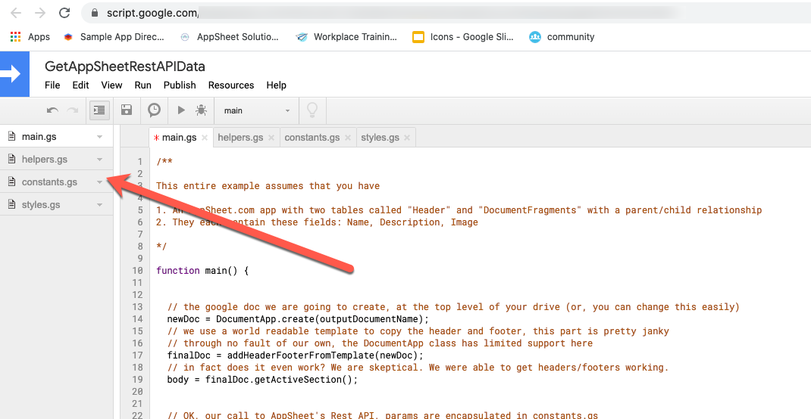

# googledoc_fromappscript_appsheet
A google script example that reads the appsheet.com api and generates a google doc using the data retrieved

## Steps to use

- Download these files and then add to your scripts.google.com as a new project. It should look like the picture shown below
- Enable Rest API support for your appsheet.com application
- Configure constants.gs to match your appsheet.com application, at a minimum what we are talking about to reproduce the example:
	- copy the app using the appsheet app linked below - this assumes you have a gmail account and logged into appsheet.com
	- Once copied, enable API support for this app, then find the newly created apikey
	- Also note the appid in this same page of your app
	- In constants.gs, edit the APIKEY to your new key from the previous step
	- In constants.gs, edit the APPID to match your new ID from your newly copied app
- Test

_There are some comments in code which may assist as well_

This example is married up to this [publicly available app](https://www.appsheet.com/samples/Companion-app-for-a-Google-App-Script-Example?appGuidString=2ada15da-4677-4aa2-ac27-7ca67b28cf65) running on appsheet.com. You have to copy this app - you cannot run this example on the published copy!

